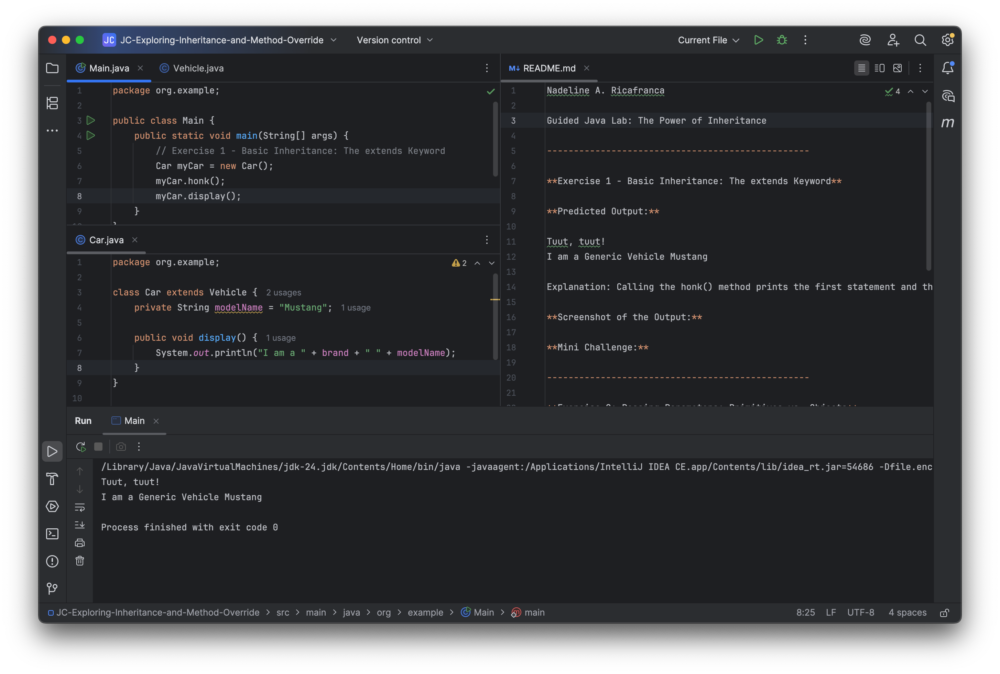
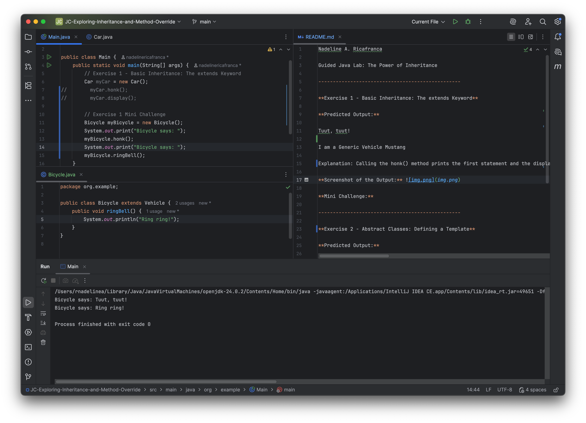
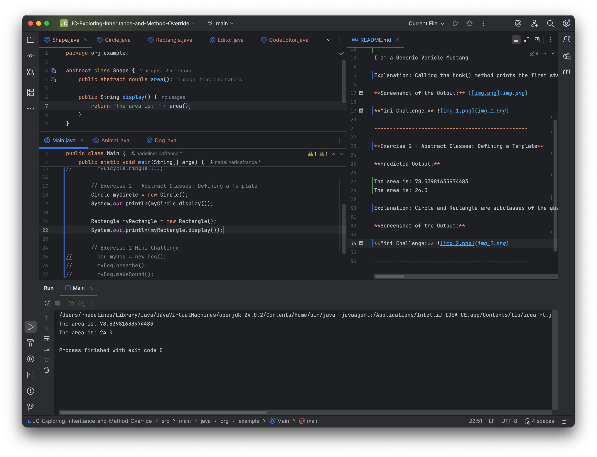
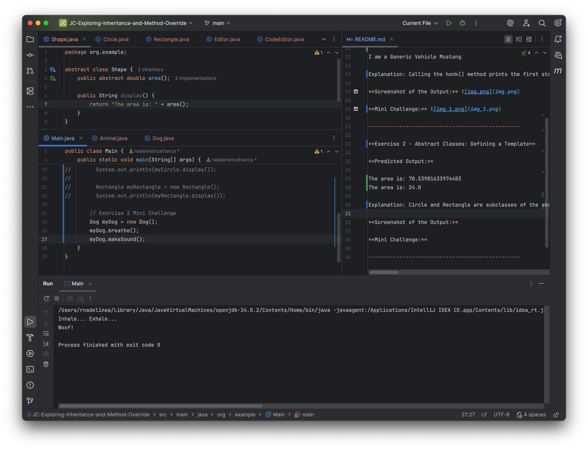
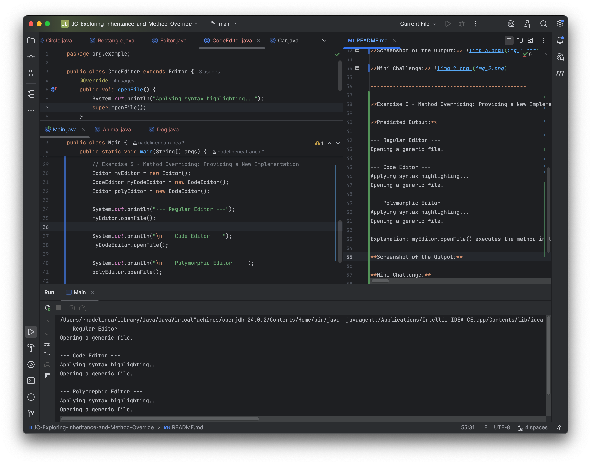
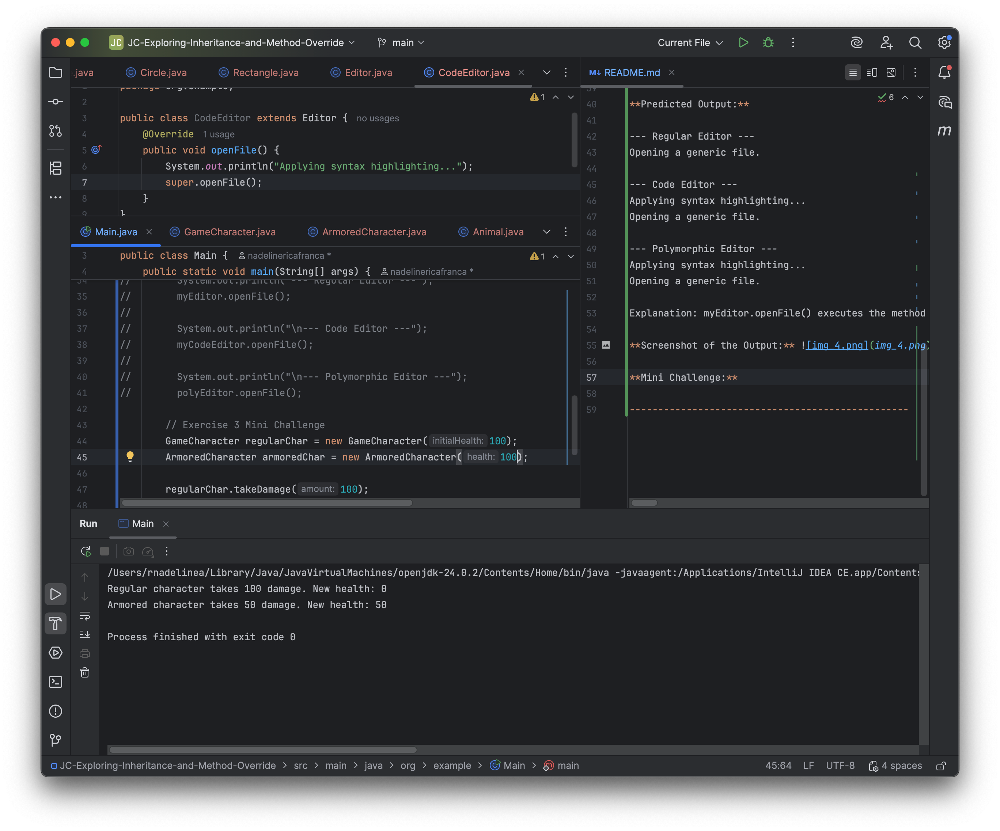
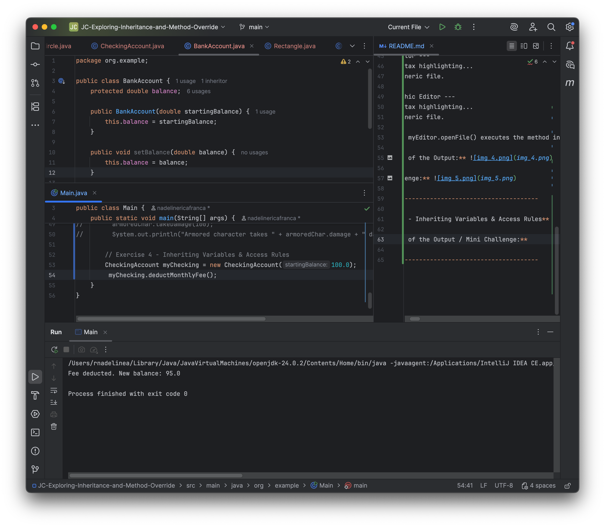

Nadeline A. Ricafranca

Guided Java Lab: The Power of Inheritance

-------------------------------------------------

**Exercise 1 - Basic Inheritance: The extends Keyword**

**Predicted Output:**

Tuut, tuut!

I am a Generic Vehicle Mustang

Explanation: Calling the honk() method prints the first statement and the display() method prints the second statement by getting the declared brand from the superclass. The child class inherits the value of _brand_ and the honk() method from its parent.

**Screenshot of the Output:** 

**Mini Challenge:** 

-------------------------------------------------

**Exercise 2 - Abstract Classes: Defining a Template**

**Predicted Output:**

The area is: 78.53981633974483
The area is: 24.0

Explanation: Circle and Rectangle are subclasses of the abstract class Shape. They each implement the abstract method area() in Shape. When calling the display() method using the created objects of the subclasses, they can execute the method since they have inherited it from Shape. Their own implementation of the area() method is used.

**Screenshot of the Output:** 

**Mini Challenge:** 

-------------------------------------------------

**Exercise 3 - Method Overriding: Providing a New Implementation**

**Predicted Output:**

--- Regular Editor ---
Opening a generic file.

--- Code Editor ---
Applying syntax highlighting...
Opening a generic file.

--- Polymorphic Editor ---
Applying syntax highlighting...
Opening a generic file.

Explanation: myEditor.openFile() executes the method in the parent class itself since its an object of Editor class. myCodeEditor.openFile() executes its own implementation of the openFile() method through overriding, but also prints the statement in the parent class' method because _super.openFile()_ executes the method from the parent class. Lastly, polyEditor.openFile() creates an Editor reference of the CodeEditor object. The method executed will be the object's overriden method, so it prints two statements.  

**Screenshot of the Output:** 

**Mini Challenge:** 

-------------------------------------------------

**Exercise 4 - Inheriting Variables & Access Rules**

**Screenshot of the Output / Mini Challenge:** 

-------------------------------------------------